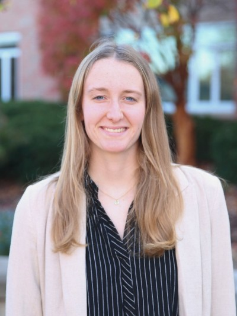
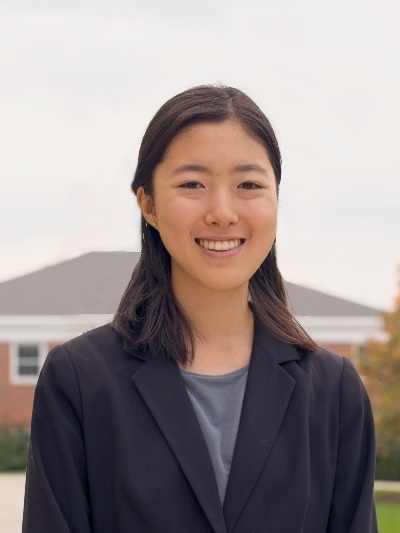
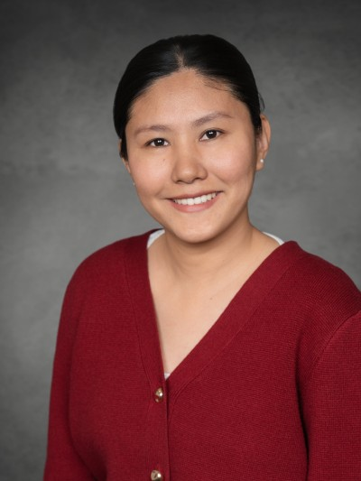
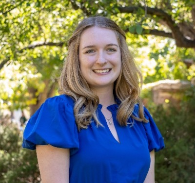
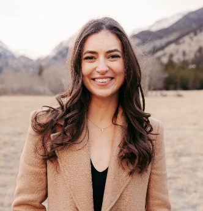

```{=html}
<!-- Team Header -->
<section class="team-header">
  <h2>Our Team</h2>
</section>

<!-- Team Grid -->
<div class="team-grid">

  <div class="team-member">
    
    <h3><a href="/Our_Team/Bryan_Dik.qmd">Bryan Dik, Ph.D.</a></h3>
    <p class="role">Principal Investigator & Director</p>
  </div>

  <div class="team-member">
    
    <h3><a href="/Our_Team/Denise_Daniels.qmd">Denise Daniels, Ph.D.</a></h3>
    <p class="role">Co-Principal Investigator</p>
  </div>

  <div class="team-member">
    
    <h3><a href="/Our_Team/Ryan_Duffy.qmd">Ryan Duffy, Ph.D.</a></h3>
    <p class="role">Co-Principal Investigator</p>
  </div>

  <div class="team-member">
    
    <h3><a href="/Our_Team/Kyle_Inselman.qmd">Kyle Inselman</a></h3>
    <p class="role">Project Manager</p>
  </div>
</div>

<!-- Collaborators -->
<section class="team-header">
  <h3>Collaborators</h3>
</section>

<!-- Grid -->
<div class="team-grid">

  <div class="team-member">
    
    <h3><a href="/Our_Team/Josh_Prasad.qmd">Josh Prasad, Ph.D.</a></h3>
    <p class="role">Senior Research Scientist</p>
  </div>

  <div class="team-member">
    
    <h3><a href="/Our_Team/Allie_Alayan.qmd">Allie Alayan</a></h3>
    <p class="role">Research Scientist</p>
  </div>

<div class="team-member">
    
    <h3><a href="/Our_Team/Dylan_Marsh.qmd">Dylan Marsh</a></h3>
    <p class="role">Research Associate</p>
  </div>
</div>

<!-- Research Assistants -->
<section class="team-header">
  <h3>Research Assistants</h3>
</section>

<!-- Grid -->
<div class="team-grid">
  <div class="team-member">
    
    <h3><a href="/Our_Team/Emily_Budik.qmd">Emily Budik</a></h3>
    <p class="role">Graduate Research Assistant</p>
  </div>
  
  <div class="team-member">
    
    <h3><a href="/Our_Team/Savannah_Jeffery.qmd">Savannah Jeffery</a></h3>
    <p class="role">Undergraduate Research Assistant</p>
  </div>
  
  <div class="team-member">
    
    <h3><a href="/Our_Team/Ines_Kim.qmd">Ines Kim</a></h3>
    <p class="role">Undergraduate Research Assistant</p>
  </div>

  <div class="team-member">
    
    <h3><a href="/Our_Team/Tenzin_Nyima.qmd">Tenzin Nyima</a></h3>
    <p class="role">Graduate Research Assistant</p>
  </div>

  <div class="team-member">
    
    <h3><a href="/Our_Team/Danielle_West.qmd">Danielle West</a></h3>
    <p class="role">Graduate Research Assistant</p>
  </div>

  <div class="team-member">
    
    <h3><a href="/Our_Team/Malory_Wissing.qmd">Malory Wissing</a></h3>
    <p class="role">Graduate Research Assistant</p>
  </div>
</div>
```
